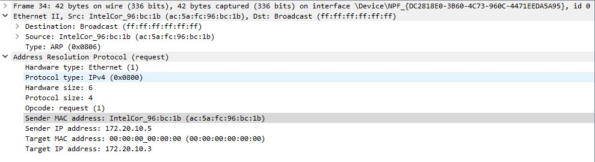

# Analyzing ARP Traffic In Wireshark

## Introduction
This lab focuses on capturing and analyzing Address Resolution Protocol (ARP) data using Wireshark, a powerful network protocol analyzer.
ARP is used in TCP/IP networks to map layer 3 IPv4 addresses to layer 2 MAC addresses. By understanding ARP messages and analyzing them, one can troubleshoot network connectivity issues and gain insights into the device communication on a local network. 

## Objectives
1. Learning how to capture ARP traffic using Wireshark.
2. Examine IPv4 and Mac address information within the captured packets.
3. Explore contents of ARP messages exchanged between devices on the Local Area Network (LAN).
4. View ARP cache entries on Windows PC.

## Skills / Concepts Demonstrated
1. Wndows Command Prompt.
2. Hands on experience in using Wireshark to analyze network traffic.
3. ARP message analysis.
4. Troubleshooting network connectivity.

## Capturing ARP Data
### Retreiving PC interface addresses
The windows command prompt was used to issue the command **_ipconfig /all_** to get information on all network adapters including four very important address information needed for this lab. These are; the Mac address, IPv4 address, Default Gateway and the Subnet mask.

**_Note_** : Two PCs connected to the same network were used for this lab. Below is the configuration information of PC2.

A **_ping_** command was issued to the Default Gateway. 

### Explanation
A ping to the default gateway with IPv4 address 172.20.10.1 was made. Each packet has a size of 32 bytes.
The four lines of replies represent the response received from the default gateway. The round trip time for the first packet was 7 milliseconds, second packet was 2 milliseconds, third packet was 1 millisecond and the fourth is 6 milliseconds. The time to live (TTL) value of packet is 64.

The ping statistics summarizes the process. We can see that 4 packets were sent and all 4 were received by the default gateway which shows a 0% loss of packet. 
The ping showed that there was successful communication with the default gateway without any packet loss.

## Examining Captured Data on wireshark
### The Request

From the diagrams above, we can see that an ARP request was made to find out the MAC address of the default gateway. The information in the request is **_"Who has 172.20.10.1? Tell 172.20.10.3_**.
We can see the source MAC address which is the address of the sender of the ARP request, a destination Mac address which is a broadcast. 
Hence, it uses the default broadcast address ff:ff:ff:ff:ff:ff. 
The protocol type, IPv4 (0x0800) informs the Network Interface Card (NIC) that the data needs to be passsed to the ARP process.

### The Reply

The information in the reply displays **_172.20.10.1 is at 8a:19:08:8c:a5:64_**. In second diagram displayed above, we see that we now have the target MAC address and the reply was sent as a unicast to the sender of the request.

A **_ping_** was made to PC1 from PC2.

## Explanation
From the diagram above, we can see that the attempt to ping PC1 with IPv4 address 172.20.10.3 failed. The request timed out shows no response from PC1. This could be due to firewall blockage on the devices trying to communicate. Therefore, a change in the firewall settings were made to unblock traffic. 
A second attempt to ping PC1 was successful as shown in the snapshot below. 

A ping to PC1 with IPv4 address 172.20.10.3 was made. Each packet has a size of 32 bytes.
The four lines of replies represent the response received from the default gateway. The round trip time for the first packet was 79 milliseconds, second packet was 70 milliseconds, third packet was 67 millisecond and the fourth is 90 milliseconds. The time to live (TTL) value of packet is 128.

The ping statistics summarizes the process. We can see that 4 packets were sent and all 4 were received by PC2 which shows a 0% loss of packet. 
The ping showed that there was successful communication with PC2 without any packet loss.

## Examining Captured Data
### The Request

From the diagrams above, we can see that an ARP request was made to find out the MAC address of PC1. The information in the request is **_"Who has 172.20.10.3? Tell 172.20.10.5_**.
We can see the source MAC address which is the address of the sender of the ARP request, a destination Mac address which is a broadcast. 
Hence, it uses the default broadcast address ff:ff:ff:ff:ff:ff. 
The protocol type, IPv4 (0x0800) informs the Network Interface Card (NIC) that the data needs to be passsed to the ARP process.

### The Reply

The information in the reply displays **_172.20.10.3 is at b4:b5:b6:c9:9f:85_**. In second diagram displayed above, we see that we now have the target MAC address and the reply was sent as a unicast to PC2.

## Viewing ARP Cache Entries

After a successful ARP process, the MAC addresses along with their corresponding IPv4 addresses are stored in Cache memory on the PC.
This is permanently removed after a sepcific perioid of time usually about 15-45 seconds. 

The command **_arp -a_** was issued in the windows command prompt to get the ARP table which has a list of stored MAC and IPv4 addresses.

# THANK YOU :smiley: 
